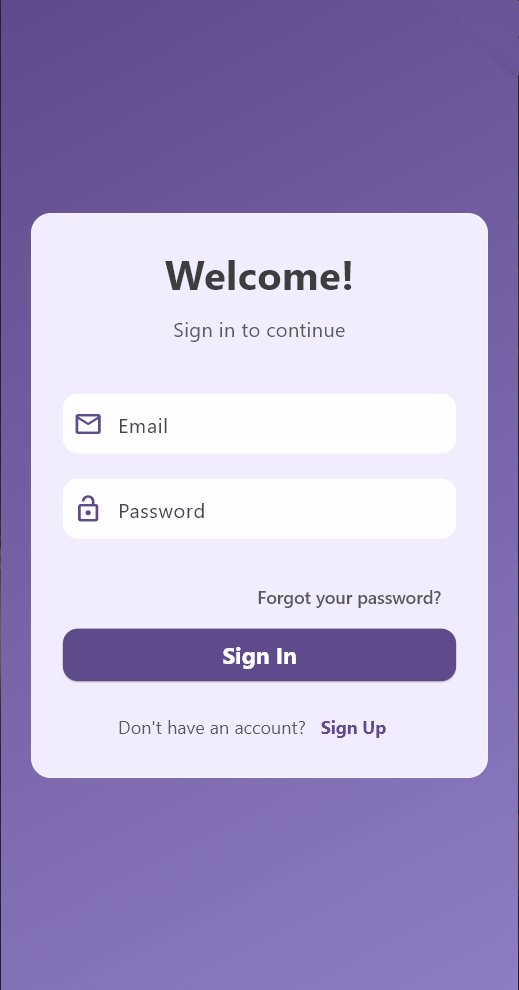
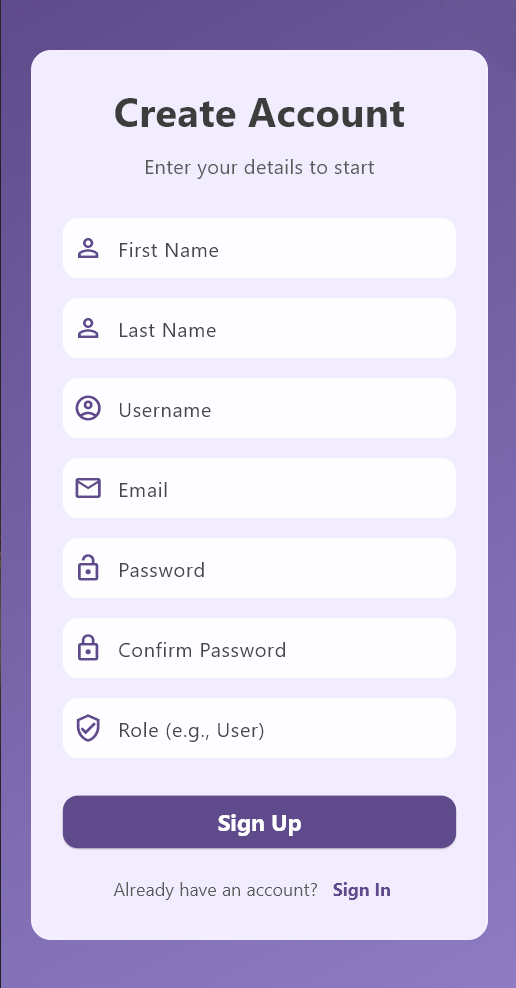
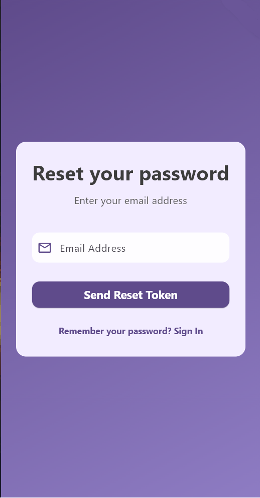
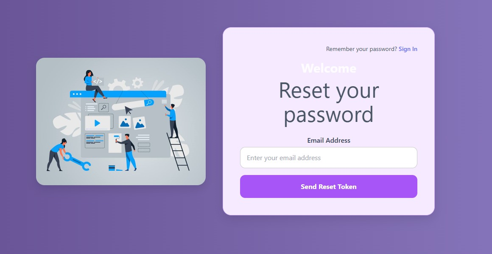

# Login Sistemi Projesi - VB10 Staj 2025

Bu proje, **VB10 Staj 2025** kapsamında geliştirilen, JWT tabanlı modern bir kimlik doğrulama (authentication) sistemidir. Proje; `.NET Core` ile geliştirilmiş bir **Backend API**, `React` ile geliştirilmiş bir **web arayüzü** ve `Flutter` ile geliştirilmiş bir **mobil uygulamadan** oluşmaktadır.

---
## Proje Görev Tanımı

Bu projenin orijinal görev tanımı ve staj kaynakları aşağıdaki dosyalarda bulunmaktadır:

- [Proje Detayları](source/Login_project.md)
- [Teknik Kaynaklar](resources.md)
- [Orijinal Depo Anasayfası](ASSIGNMENT.md)

---

## Takım Üyeleri

- **Backend**: Ozan Küçük
- **Frontend (Web)**: Ege Öztürk ve Ali Buğra Tekin  
- **Mobil (Flutter)**: Berkin Dönmez ve Bora Özdamar  

---

## Kullanılan Teknolojiler

- .NET Core (Web API)
- React (Frontend)
- Flutter (Mobil)
- Docker
- JWT Authentication

---

## Özellikler (Features)

- Kullanıcı Kaydı (Register)  
- Kullanıcı Girişi (Login)  
- JWT ile Güvenli Oturum Yönetimi  
- Şifre Sıfırlama Akışı (Forgot/Reset Password)  
- Responsive Web Arayüzü  
- Cross-Platform Mobil Uygulama (Android & iOS)  

---

###  Ekran Görüntüleri

#### Mobil Uygulama (Flutter)

      

#### Web Arayüzü (React)

      


---

## Kurulum ve Çalıştırma

Projeyi yerel ortamınızda çalıştırmak için aşağıdaki adımları takip edin.

### Ön Gereksinimler

Aşağıdaki araçların bilgisayarınızda kurulu olduğundan emin olun:

- **Docker Desktop**: Backend servisini çalıştırmak için  
  [Docker Desktop İndirme Sayfası](https://www.docker.com/products/docker-desktop)

- **Flutter SDK**: Mobil uygulamayı geliştirmek ve çalıştırmak için  
  [Flutter SDK Kurulum Rehberi](https://docs.flutter.dev/get-started/install)

- **Node.js**: Web arayüzünü çalıştırmak için  
  [Node.js İndirme Sayfası](https://nodejs.org)

---

### Çalıştırma Adımları

#### 1. Backend'i Başlatın (.NET)

```bash
# Projenin kök dizininden backend klasörüne gidin
cd backend

# Docker image'ını oluşturun
docker build -t login-backend .

# Docker konteynerini başlatın
docker run -p 5000:8080 login-backend

# Bu terminali açık bırakın. Backend artık http://localhost:5000 adresinde çalışıyor.
```
#### 2. Mobil Uygulamayı Başlatın (Flutter)

```bash
# Yeni bir terminal açın

# Mobil uygulama klasörüne gidin
cd mobil/login_app

# Gerekli paketleri yükleyin
flutter pub get

# .env dosyasını oluşturun ve API adresini girin
# (Detaylar için /mobil/README.md dosyasına bakın)

# Uygulamayı çalıştırın
flutter run
```
#### 3. Web Arayüzünü Başlatın (React)

```bash
# Yeni bir terminal açın

# Web projesi klasörüne gidin
cd frontend

# Gerekli paketleri yükleyin
npm install

# Geliştirme sunucusunu başlatın
npm run dev

# Terminalde yazan localhost adresini (örn: http://localhost:5173) tarayıcıda açın.
```

---

## Gelecek Geliştirmeler ve Tartışma (Future Work & Discussion)

Bu proje, staj kapsamında modern bir kimlik doğrulama sisteminin tüm katmanlarıyla nasıl geliştirileceğini göstermek amacıyla tamamlanmıştır. Ancak projenin üretim ortamı standartlarına ulaşması için aşağıdaki geliştirmeler önerilmektedir:

- **Güvenli Şifre Sıfırlama Akışı**  
  Mevcut sistemde, şifre sıfırlama token'ı test amaçlı doğrudan kullanıcıya gösterilmektedir. Gerçek bir senaryoda, bu token güvenli bir SMTP e-posta servisi aracılığıyla kullanıcının kayıtlı adresine gönderilmelidir.

- **JWT Oturumunun Kalıcılığı (Mobil)**  
  Mobil uygulamada giriş yapıldıktan sonra alınan JWT token, `flutter_secure_storage` gibi güvenli bir alanda saklanarak uygulama yeniden açıldığında otomatik oturum devamlılığı sağlanabilir.

- **İstemci Taraflı Doğrulama (Client-Side Validation)**  
  Giriş/kayıt ekranlarında kullanıcıdan alınan verilerin (örneğin e-posta formatı veya boş alanlar) istemci tarafında kontrol edilmesi, hem kullanıcı deneyimini artırır hem de gereksiz API isteklerini azaltır.

- **Google / Facebook ile Sosyal Giriş Desteği (OAuth 2.0)**  
  Kullanıcıların e-posta ve şifre yerine Google veya Facebook hesaplarıyla kolayca giriş yapabilmesi için sosyal kimlik sağlayıcılarının entegre edilmesi planlanmaktadır. Bu sayede hem kullanıcı deneyimi artacak hem de kayıt işlemleri hızlanacaktır.

---


## İletişim

Bu projeyi geliştiren ekibe aşağıdaki bağlantılardan ulaşabilirsiniz:

### Berkin Dönmez 

- GitHub: https://github.com/berkindonmezz
- LinkedIn: https://www.linkedin.com/in/berkindonmez

### Ozan Küçük

- GitHub: https://github.com/haytlife
- LinkedIn: https://www.linkedin.com/in/ozan-küçük-857b47280

### Ali Buğra Tekin

- GitHub: https://github.com/alibugratekin
- LinkedIn: https://www.linkedin.com/in/ali-bugra-tekin

### Ege Öztürk 

- GitHub: https://github.com/EgeOzturk01
- LinkedIn: https://www.linkedin.com/in/ege-%C3%B6zt%C3%BCrk-8aa244371/

### Bora Özdamar

- GitHub: https://github.com/ijustwatchedmrrobot
- LinkedIn: https://www.linkedin.com/in/said-bora-ozdamar/


